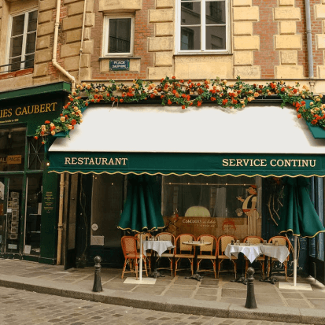
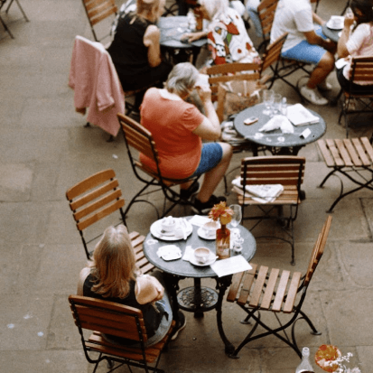
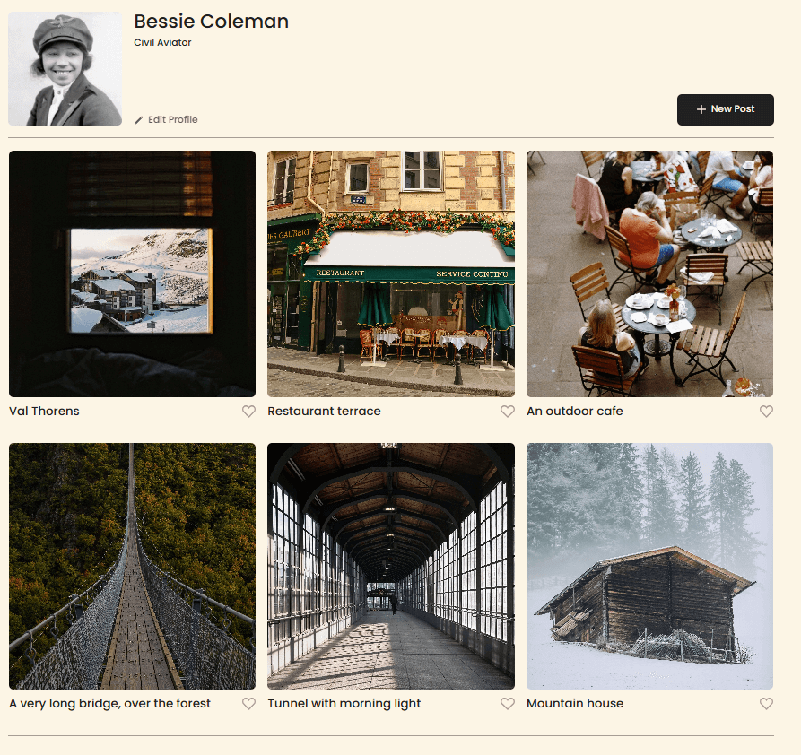
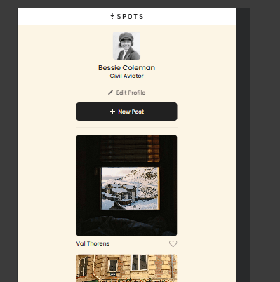

# Project 3: Spots

This is the third project of the Software Engineering program at TripleTen. It was created using HTML and CSS, based on the Figma design.

### Overview

- Intro
- Figma
- Images

**Intro**

This project is made so all the elements are displayed correctly on popular screen sizes. To do this, I used the grid property to display thee card elements into columns and rows. I also used the flex box property to arange the header. In order to make the webpage responsive, I used media queries to adjust elements as the screen size changes.

- [Link to Project](https://jayniech.github.io/se_project_spots/)

**Figma**

- [Link to the project on Figma](https://www.figma.com/file/BBNm2bC3lj8QQMHlnqRsga/Sprint-3-Project-%E2%80%94-Spots?type=design&node-id=2%3A60&mode=design&t=afgNFybdorZO6cQo-1)

**Images**

